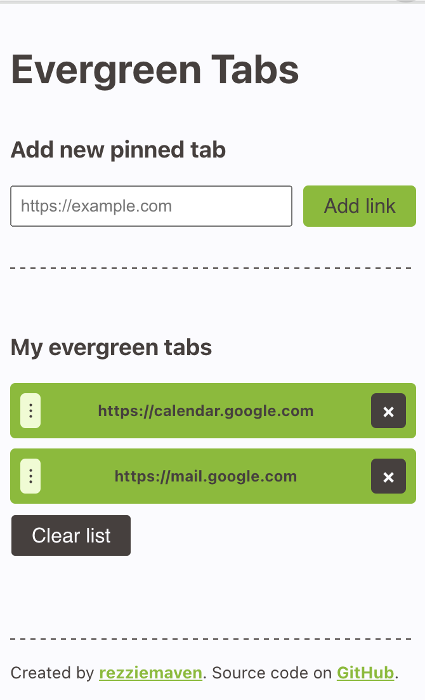

# Evergreen Tabs

An open source Chrome extension that opens a list of pinned, 'evergreen' tabs when a new window is opened or restored.

This extension was inspired by [Forever Pinned](https://chromewebstore.google.com/detail/forever-pinned/nigigpmchbpkjjgncmpiggfnikllldlh?pli=1), an outdated Chrome extension that may soon be removed by the Chrome Web Store as it no longer meets their best practices. The project is also not open source, which was another motivation for building this extension (contribution guidelines coming soon).

## Features

- Add and save a list of links that should always be pinned in a window
- Open your pinned tabs when a new window is opened or an existing one is restored.
- Edit list of pinned tabs by changing order or removing links from your list of evergreen tabs

## Installing Evergreen Tabs

The extension isn't currently on the Chrome Web Store but will be at some point. In the meantime, you can use it by downloading the latest release, extracting the zipped file, and installing it as follows:

1. Click on the **Extensions** (puzzle icon) button in your browser and select **Manage extensions** at the bottom of the menu.
1. Enable Developer mode by clicking the toggle switch next to **Developer Mode** in the top right of the window.
1. Click the **Load unpacked** button and select the extension folder.
1. Once successfully installed, pin the extension in the Extensions menu so you have quick access to the extension in your browser.

## Using Evergreen Tabs

Using Evergreen Tabs is very simple.

1. Click on the extension icon to open a popup that lets you enter and manage your list of pinned, 'evergreen' tabs.
1. Add a link by entering the URL (starting with http:// or https://) into the input and then clicking the **Add Link** button.
1. Edit your list of evergreen tabs by dragging the links to change the order that they should be pinned, deleting any individual link, or removing all links using the **Clear list** button.

## Reporting issues

If there are any bugs with this extension, please [submit a new issue](https://github.com/rezziemaven/evergreen-tabs/issues). There's currently no issue template, but kindly use the following prefixes to help me categorise the request:

- [BUG]: When you've identified a bug with this extension that needs addressing.
- [FEATURE REQUEST]: When you have an idea that could make this extension better.

## Contributions

I'd love to have your help on this project if you find it useful! I don't currently have any contributions guidelines in place, but do watch this space!
